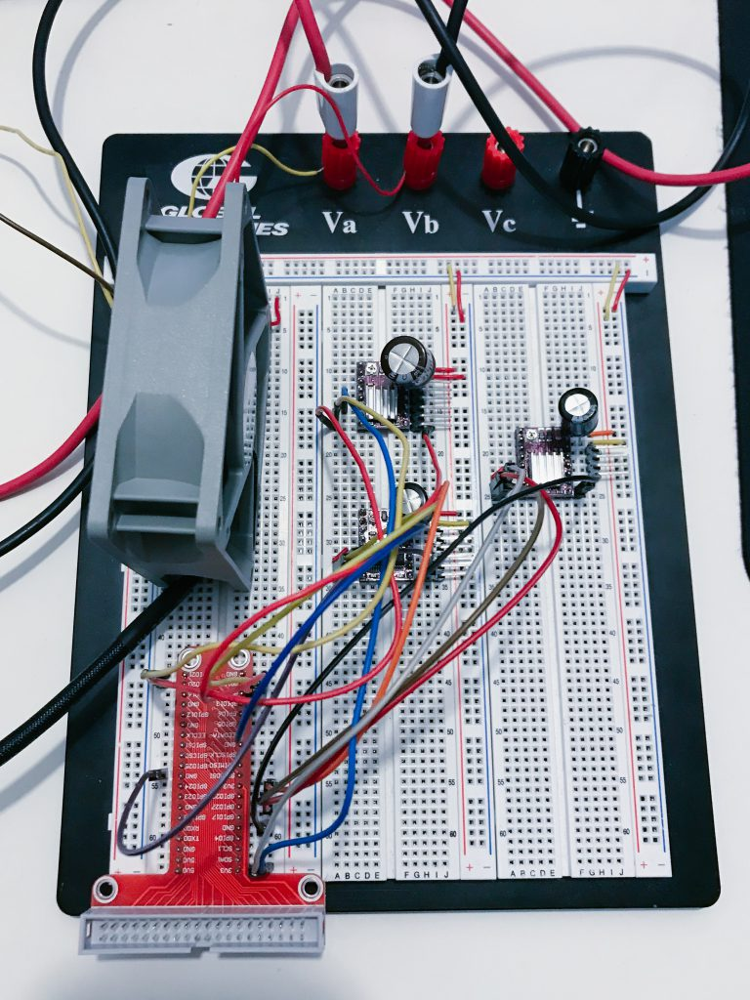

[Click here to see V1](https://www.seanngpack.com/Robotic-Arm-V1/)

[Github Repo](https://github.com/seanngpack/3D-Printed-Robotic-Arm)

###The video below captures what happened after we finally got the arm working. I think it was one of the happiest moments of my life.
`video: https://youtu.be/8EcQYNPEbdQ`

#Contributers:
* [John Nguyen - Electronics design, computer vision, inverse kinematics](https://www.linkedin.com/in/johnnguy/)
* [Maybellene Aung - Mechanical design](https://www.linkedin.com/in/maybellene-aung/)
* [Alistair Wick - Inverse kinematics algorithms](https://www.linkedin.com/in/alistairwick/)

#Okay, let's talk about the arm now
I made robotic arm earlier in the year but I wanted to do better, so I started from scratch and built another arm. I did all the part sourcing, mechanical design, prototyping, and assembly in only 2 weeks. I spent half a day to plan each of the 14 days I had down to the exact hour then executed it.

# Sourcing
For this project, budget was not a big constraint. I wanted things fast and was willing to pay for it. I scheduled the most crucial items to come first: the [stepper motors](https://www.amazon.com/Stepper-Bipolar-Connector-compatible-Printer/dp/B00PNEQKC0/ref=sr_1_3?ie=UTF8&qid=1548223968&sr=8-3&keywords=stepper+motor)/drivers, black screws, thrust bearings, ball bearings, and stepper couplers. Most of these parts came from Amazon and eBay--no Aliexpress this time.

# SolidWorks design
I drew several sketches focusing on aesthetics and functionality. I reused the Matlab script I was made earlier to determine the dimensions of the arm. Then I built it all in SolidWorks. I printed parts as I designed them to speed development time. I also performed stress analysis on the parts to see where the stress concentrations are located and designed to reduce them.

#Base rotation mechanism
I'm pretty proud of this novel rotation system I designed. I have a downward facing stepper motor with a coupler secured to a rigid plate. A [ball thrust bearing](https://www.amazon.com/gp/product/B002BBO3PY/ref=oh_aui_search_asin_title?ie=UTF8&psc=1) allows the system to rotate with less friction. I later replaced the ball thrust bearing with a [needle thrust bearing](https://www.amazon.com/gp/product/B002IG3FBA/ref=oh_aui_search_asin_title?ie=UTF8&psc=1) to further reduce the thickness of the system and increase the spread of weight across a greater area providing very noticeably greater stability. 

#Electronics design
I worked with my friend John Nguyen to create the electronics for the robot. We used an industrial-grade breadboard to house the circuitry. We sourced a [cheap 10A power supply](https://www.ebay.com/itm/30V-10A-110V-DC-Power-Supply-Precision-Variable-Digital-Adjustable-Clip-Cable-US/201664929313?epid=1983222677&hash=item2ef42a9e21:g:N0gAAOSwRZdboFwj:rk:1:pf:1) to drive the hungry [2A stepper motors](https://www.amazon.com/Stepper-Bipolar-Connector-compatible-Printer/dp/B00PNEQKC0/ref=sr_1_3?ie=UTF8&qid=1548223968&sr=8-3&keywords=stepper+motor). Choosing stepper drivers was easy, we settled on [DRV8825](https://www.pololu.com/product/2133) drivers because they were cheap, accurate, and easy to use. We used the top of the breadboard as the main power rail then split it into individual rails for each driver. We also included a [Noctua fan](https://www.amazon.com/Noctua-NF-A12x15-PWM-Premium-Quality-Quiet/dp/B071W6HJP6/ref=sr_1_1_sspa?ie=UTF8&qid=1548223947&sr=8-1-spons&keywords=Noctua+fan+120mm&psc=1) to cool the drivers down. This is a non-permanent solution, we hope to move away from the breadboard and make a very small integrated solution that fits into the base of the robot.

#Programming
We developed our software on a small Raspberry Pi 3 using python. We made a simple GUI that controlled axis movement of the robot. A simple GUI controller was cool, but we wanted more so we looked to inverse kinematics. I lead group sessions with the team members and worked on learning inverse kinematics to control the robot. We developed a rudimentary solution, but the accuracy was too low to be viable. So I reached out to [Alistair Wick](https://www.linkedin.com/in/alistairwick/) and he generously allowed us to use his inverse kinematics algorithmn for our project. John and I dove into his algorithmns and adapted them to be compatible with steppers motors and our project. 

#Iterative improvements
I replaced the 3mm bearings with [bushings](https://www.amazon.com/Hobbypark-Steering-Bushing-Sleeves-Redcat/dp/B01N3OQEO7/ref=sr_1_1?ie=UTF8&qid=1548224094&sr=8-1&keywords=3mm+bushing). There is an addition of marginal rotational friction, but the lateral wiggling is greatly reduced.

#Next steps
I haven't worked on this arm in a while because I was in San Francisco for my second co-op. Now that I'm back in school development is resuming and we're currently working on the hand design and computer vision.

