## **Github**
- Python: https://github.com/seanngpack/swag-scanner

- C++: https://github.com/seanngpack/swag-scanner-cpp

`video: https://youtu.be/pr8KoeEaKFc`


## **About**

SwagScanner is a 3D scanning system in active development that scans an object into cyberspace. The user places an object on the rotating bed and is sacnned at a constant interval for a full rotation. The data goes through a processing pipeline and outputs a refined pointcloud. Swag Scanner has two codebases: one in Python(inactive) and one in C++. This page serves as documentation of current development and information about how the scanner works.

<details>
  <summary>Features</summary>
</br> 

&nbsp;&nbsp;&nbsp;&nbsp; **Software** \
&nbsp;&nbsp;&nbsp;&nbsp;&nbsp;&nbsp;&nbsp; High performance codebases in C++ and Python \
&nbsp;&nbsp;&nbsp;&nbsp;&nbsp;&nbsp;&nbsp; Extensible camera interface allows use of any depth camera \
&nbsp;&nbsp;&nbsp;&nbsp;&nbsp;&nbsp;&nbsp; Super fast depth deprojection \
&nbsp;&nbsp;&nbsp;&nbsp;&nbsp;&nbsp;&nbsp; Saves pointclouds to files \

&nbsp;&nbsp;&nbsp;&nbsp; **Hardware** \
&nbsp;&nbsp;&nbsp;&nbsp;&nbsp;&nbsp;&nbsp; Elegant, integrated design \
&nbsp;&nbsp;&nbsp;&nbsp;&nbsp;&nbsp;&nbsp; Simple bottom-up assembly \
&nbsp;&nbsp;&nbsp;&nbsp;&nbsp;&nbsp;&nbsp; Self-locking gearbox \
&nbsp;&nbsp;&nbsp;&nbsp;&nbsp;&nbsp;&nbsp; Rotating bed can withstand high axial & radial loads 

&nbsp;&nbsp;&nbsp;&nbsp; **Electronics** \
&nbsp;&nbsp;&nbsp;&nbsp;&nbsp;&nbsp;&nbsp; Custom vertical board design \
&nbsp;&nbsp;&nbsp;&nbsp;&nbsp;&nbsp;&nbsp; Easy hotswapping of motor driver and arduino boards \
&nbsp;&nbsp;&nbsp;&nbsp;&nbsp;&nbsp;&nbsp; Minimized number of cables and cable lengths

</br>

</details> 
</br>

<details>
  <summary>Initial design process</summary>
</br> 

 I took inspiration from existing devices and sketched several different designs of the hardware architecture of the scanner. One of the main hardware decisions is whether I wanted the scanner have a camera revolve around an object, or have the object rotate. I chose the latter because that approach seemed to result in high accuracy scans in addition to being much more feasible to create. Then I narrowed in to more of the specifics of the scanner, I wanted it to look aesthetic, have minimal cables, and support small-medium sized objects. I achieved these design objectives by creating a modular scanner design where the distance between the scanning bed and camera can be adjusted both in height and length and the cables are hidden in this mechanism. I created some basic dimensions for my sketch and begun ordering metal hardware. Then I sketched and planned the electronics layout to fit inside my mechanical housing and ordered those parts soonafter. I wanted the electronics to be robust and repairable so I created my own stacked board design where the Arduino and motor driver can be hotswapped without soldering. As those parts were arriving, I hopped onto Fusion360 and CADed up my design to be 3D printed. As an additional challenge, I only used my trackpad to do the CAD. I took care in designing keep-out regions where the electronics were to be housed so heat buildup and other part interference would be mitigated. I also went through many iterations to make the assembly of the parts extremely easy, which was one of the hardest parts of the build because I had to work through building and designing the hardware backwards and forwards, anticipating pain points. Getting tolerances for fitting 3D printed parts was pretty easy as I have a lot of experience in 3D printed designs for my past personal projects and during my co-op at Speck. As I was wrapping up CAD design, I 3D printed the parts and started coding the brains of the project. I had to bust out my linear algrebra textbooks again to understand better how to program the scanner. I chose Python as the language because of its ease of use. I sketched up the architecture of my program and implemented it quickly before I had to leave California to go back to Boston. I managed to come up with a working prototype and even got to show it off at JPL for my final presentation!

</br>

</details> 
</br>

## **Scanning Pipeline**

In this section I include visuals and brief explanations on how the calibration, scanning, and processing pipelines work. This section is continuously updated as the pipeline changes.

<details>
  <summary>More details</summary>
</br> 

The diagrams shown in this section are very high-level overviews of the flow of the program. The diagrams show sequential actions, cuncurrency processing is detailed in other sections. The image below shows how user input is used to select the appropriate pipeline to use.

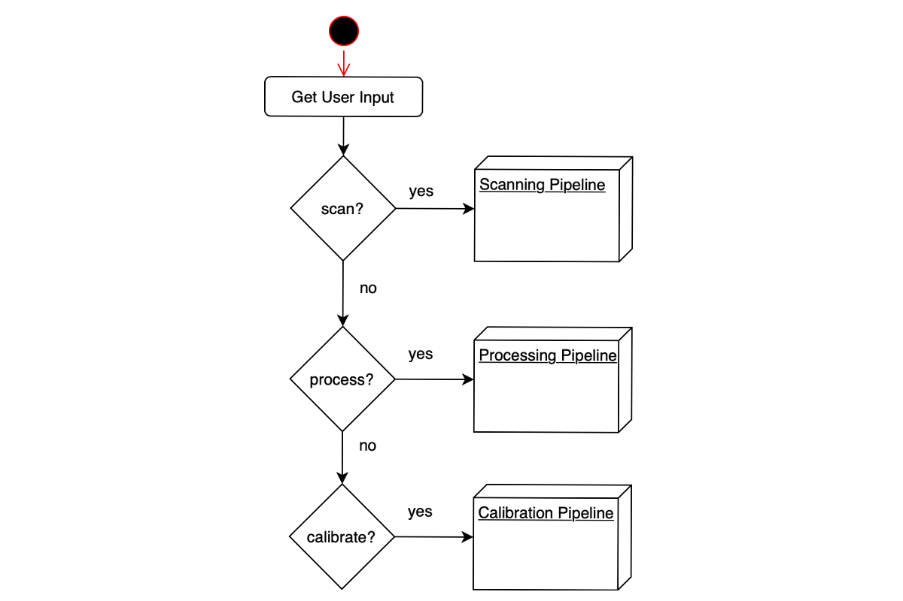

The image below shows how scanning, processing, and calibration work.

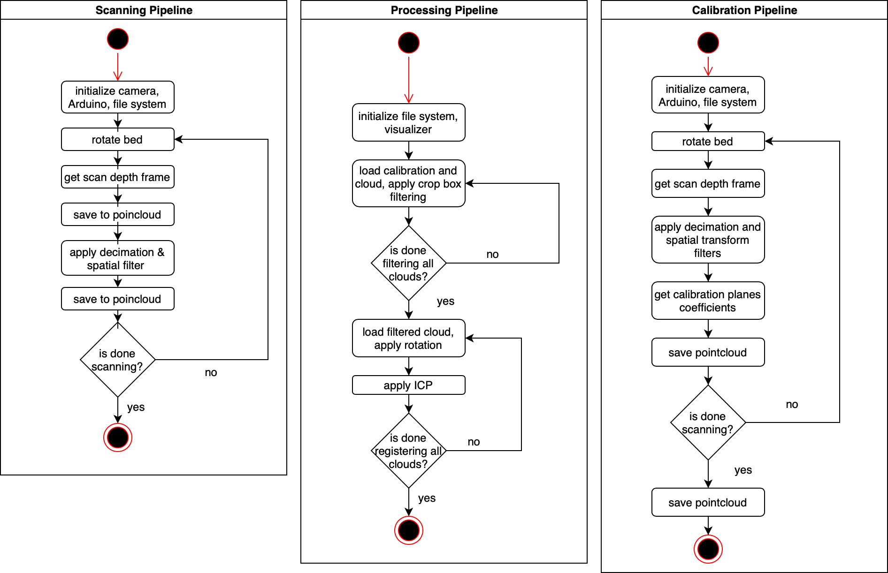

</br>

</details> 
</br>


## **Calibration**

This section details the method I used to calculate the center of the rotation table and how it is used to perform initial registration and point removal. If you like linear algebra, you're in for a treat!

<details>
    <summary>warning: lots of math</summary>
</br>

### Calibration fixture
Here is the physical calibration fixture. It has a upright plane and ground plane. This design is inspired by the calibration fixture used on the 3D scanner I worked on at JPL. $G$ represents the ground plane normal, $U$ the upright plane normal, $c$ the center point, and $L$ the line of intersection between the ground and upright planes.

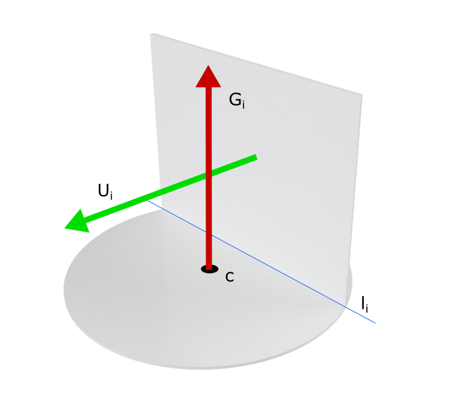

### Calculating axis of rotation
The axis of rotation is the normal direction vector of the ground plane, $G$. Using RANSAC plane segmentation, the equation of the ground plane can be easily extracted. Multiple scans are taken the final rotation axis is calculated by taking the average of the normals.

$$
G=\frac{\sum _{i=0}^n G_i}{n}
$$

### Calculating center point
The distance between the point $c$ and line $l$ is the same for each scan. Knowing this geometric relation, we can derive equations to calculate for this distance and ultimately solve for $c$.

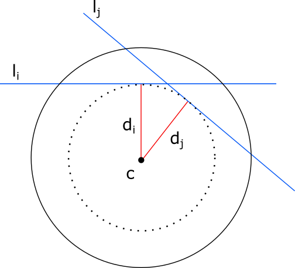

First we start with some definitions:

$$
Upright plane = [u_{x_i}, u_{y_i}, u_{z_i}, u_{d_i}]
$$

$$
Ground plane = [g_x, g_y, g_z, g_d]
$$

$$
U = [u_{x_i}, u_{y_i}, u_{z_i}]
$$

$$
G = [g_x, g_y, g_z]
$$

$$
c = [c_x, c_y, c_z]
$$

We calculate the line of intersection $l$ below:

$$
l_i=\frac{\left\{\left| 
\begin{array}{cc}
 u_{y_i} & g_y \\
 u_{d_i} & g_d \\
\end{array}
\right| ,\left| 
\begin{array}{cc}
 u_{d_i} & g_d \\
 u_{x_i} & g_x \\
\end{array}
\right| ,0\right\}}{\left| 
\begin{array}{cc}
 u_{x_i} & g_x \\
 u_{y_i} & g_y \\
\end{array}
\right| } + x * \left\{u_{x_i},u_{y_i},u_{z_i}\right\}\times \left\{g_x,g_y,g_z\right\}
$$

$$
\small l_i=\left\{\frac{u_{y_i} g_d-g_y u_{d_i}}{u_{x_i} g_y-g_x u_{y_i}}+x \left(u_{y_i} g_z-g_y u_{z_i}\right),\frac{g_x u_{d_i}-u_{x_i} g_d}{u_{x_i} g_y-g_x u_{y_i}}+x \left(g_x u_{z_i}-u_{x_i} g_z\right),x \left(u_{x_i} g_y-g_x u_{y_i}\right)\right\}
$$

Now we get the line $\overline{CP}$ where P is a point on $l$:

$$
P_x=\frac{u_{y_i} g_d-g_y u_{d_i}}{u_{x_i} g_y-g_x u_{y_i}}
$$

$$
P_y=\frac{g_x u_{d_i}-u_{x_i} g_d}{u_{x_i} g_y-g_x u_{y_i}}
$$

$$
P_z = 0
$$

$$
\overline{CP}=\left\{c_x-p_x,c_y-p_y,c_z-p_z\right\}
$$

$$
\overline{CP}=\left\{c_x-\frac{u_{y_i} g_d-g_y u_{d_i}}{u_{x_i} g_y-g_x u_{y_i}},c_y-\frac{g_x u_{d_i}-u_{x_i} g_d}{u_{x_i} g_y-g_x u_{y_i}},c_z\right\}
$$

We can now calculate the area of the parallelogram $A$ by taking the norm of the cross product of $\overline{CP}$ and the direction of $l$:

$$
\tiny

A_i= \| \left\{c_x-\frac{u_{y_i} g_d-g_y u_{d_i}}{u_{x_i} g_y-g_x u_{y_i}},c_y-\frac{g_x u_{d_i}-u_{x_i} g_d}{u_{x_i} g_y-g_x u_{y_i}},c_z\right\}\times \left\{u_{y_i} g_z-g_y u_{z_i},g_x u_{z_i}-u_{x_i} g_z,u_{x_i} g_y-g_x u_{y_i}\right\} \|
$$

At this point we can calculate $d$ by taking the area of the parallelogram $A$ and dividing it by the base of the shape $l$, or norm of $P$ over the norm of the direction of $l$:

$$
d=\frac{\| A_i\| }{\| l_i\| }
$$

The symbolic solution is very complex, so here is an elegant solution derived by the Yuping Ye and Zhan Song of [this paper](https://www.researchgate.net/publication/308822289_An_accurate_3D_point_cloud_registration_approach_for_the_turntable-based_3D_scanning_system) using a similar method: 

$$
d_i=\frac{\| \left(c_x g_x+c_y g_y+g_z\right) \|}{\| \left(g_x+g_y+g_z\right)\times \left(u_{x_i},u_{y_i},u_{z_i}\right) \|}
\cdot c_x u_{x_i}+c_y u_{y_i}+c_z u_{z_i}+u_{d_i}
$$

Mentioned earlier, we know that $d$ should be the same for each iteration so:

$$
d_i-d_{i+1}=0, i=1,2,\text{...}n-1
$$

And we can write out the matrix form as:

$$
A_{n-1\times3} X_{1\times3} = B_{n-1\times1}
$$

$$
\small
A = \left[
  \begin{matrix}
   \frac{\| G \|}{\| G\times U_1 \|} u_{x_1} - \frac{\| G \|}{\| G\times U_1 \|} u_{x_2} & 
   \frac{\| G \|}{\| G\times U_1 \|} u_{y_1} - \frac{\| G \|}{\| G\times U_1 \|} u_{y_2} &
   \frac{\| G \|}{\| G\times U_1 \|} u_{z_1} - \frac{\| G \|}{\| G\times U_1 \|} u_{z_2} \\
   
   \frac{\| G \|}{\| G\times U_{n-1} \|} u_{x_{n-1}} - \frac{\| G \|}{\| G\times U \|} u_{x_n} & 
   \frac{\| G \|}{\| G\times U_{n-1} \|} u_{y_{n-1}} - \frac{\| G \|}{\| G\times U_1 \|} u_{y_n} &
   \frac{\| G \|}{\| G\times U_{n-1} \|} u_{z_{n-1}} - \frac{\| G \|}{\| G\times U_1 \|} u_{z_n}

\end{matrix}
\right]
$$

$$
X = 
  \left[\begin{matrix}
   c_x \\
   c_y \\
   c_z
\end{matrix}
\right]
$$

$$
B = \left[
  \begin{matrix}
   \frac{\| G \|}{\| G\times U_2 \|} u_{d_2} - \frac{\| G \|}{\| G\times U_1 \|} u_{d_1} \\
   \frac{\| G \|}{\| G\times U_3 \|} u_{d_3} - \frac{\| G \|}{\| G\times U_2 \|} u_{d_2} \\
   \frac{\| G \|}{\| G\times U_n \|} u_{d_n} - \frac{\| G \|}{\| G\times U_{n-1} \|} u_{d_{n-1}} 
\end{matrix}
\right]
$$

You still here? We're almost done! We know $U$ and $G$ so our only unknowns are in the $X$ matrix. If we take more than three scans we get an overdetermined system--more equations than unknowns. We can find the approximate solution of an overdetermined solution using a least sqaures method. Using MATLAB's linear least squares method `lsqr` and Eigen's `bdcsvd` method return the same results.


### Aligning point cloud to world coordinate
Okay, so we have the axis of rotation and center point now. This is exactly what is needed to transform a scanned pointcloud to the world origin coordinate frame. Aligning a pointcloud to the world frame is useful for several reasons. First, it simplies the process of applying a rigid rotation. Second, it makes understand the raw data in the points more intuitive because the reference point is (0,0,0). Also, it simplifies defining the dimensions of a box filter. Doing this transformation is easy, just perform a rigid translation to the camera frame, then align the z-axis and we're done.

We know that the center coordinate $C$ is a rigid transform from the camera frame (0,0,0) to the point $C$. We multiply the transform by -1 to get the transform from $C$ to camera and compose it as a 4x4 translation matrix.

$$
C = -1 * C
$$

$$
trans = 
  \left[\begin{matrix}
   1 & 0 & 0 & c_x \\
   0 & 1 & 0 & c_y \\
   0 & 0 & 1 & c_z \\
   0 & 0 & 0 & 1 \\
\end{matrix}
\right]
$$


Next, we want get the angle between the axis of rotation and camera z-axis, $\theta$. Getting this angle allows us to know the rotation to make the z-axis point upwards in the final cloud. The angle between the normalized axis of rotation and camera z-axis is their dot product:

$$
\theta = -G \bullet \left[0,0,1\right]
$$

Sweet, we know $\theta$. To align the axis of rotation to the camera z, we have to perform the rotation about the x axis. Let's construct the 4x4 rotation matrix:

$$
rot = 
  \left[\begin{matrix}
   1 & 0 & 0 & 0 \\
   0 & \cos(\theta) & -\sin(\theta) & 0 \\
   0 & \sin(\theta) & \cos(\theta) & 0 \\
   0 & 0 & 0 & 1 \\
\end{matrix}
\right]
$$

And now we create an affine transformation matrix by applying the rotation onto the translation. We want to translate first, and then rotate:

$$
affine=\left[\begin{matrix}
   1 & 0 & 0 & 0 \\
   0 & \cos(\theta) & -\sin(\theta) & 0 \\
   0 & \sin(\theta) & \cos(\theta) & 0 \\
   0 & 0 & 0 & 1 \\
\end{matrix}\right] 
\left[\begin{matrix}
   1 & 0 & 0 & c_x \\
   0 & 1 & 0 & c_y \\
   0 & 0 & 1 & c_z \\
   0 & 0 & 0 & 1 \\
\end{matrix}
\right]
$$

At this point we can use the result onto our pointcloud and align it to the world origin with z pointing up! The image below shows the original cloud in green, and the transformed cloud in blue.

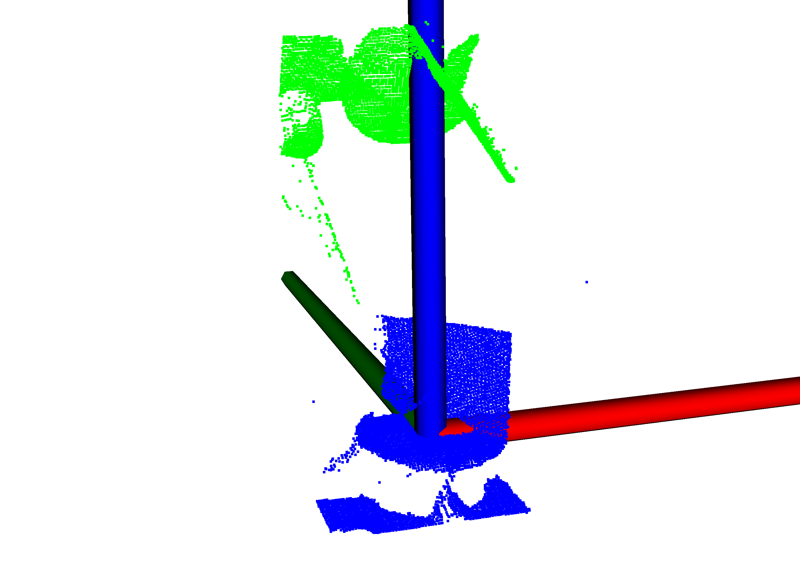

### Automatic point removal
After aligning the pointcloud to the world origin, we can define a crop box where points outside of this box get eliminated. The box is easily constructed because we know the center point (0,0,0), so any distance added to that point defines the boundary of the box.


</details>
</br>


## **Software Design**

SwagScanner's codebase is quickly growing with a multitude of features being added. 

<details>
  <summary>C++ Program Design</summary>
</br>

*** This section is still WIP ***

### High level architecture
I utilized MVC (model-view-controller) pattern to organize the project structure. I chose this pattern for clear separation of concerns. 

#### **Model**

The models are represented by the data handling objects which include the ```Arduino```, ```Camera``` and main ```Model``` classes. These model objects are managed by the controllers.

#### **Controller**

Controllers handle the the logic for the scanning, calibration, and processing pipelines in addition to connecting the models to the views. I created an IController abstract base class which is functionally equivalent to a Java abstract class. This base class contains pure virtual methods implemented by specialized controllers such as ```CalibrationController```. This way, I can store specialized controllers as its abstract type, ```IController```, and simply call ```run()``` to run the controller and perform their specialized task. Later, when I added a GUI, I did not have to refactor the original implementations of ```IController``` and its children. I accomplished this through multiple inheritance. First, I made a ```IControllerGUI``` abstract base class that inherited ```IController```. Then, its specialized child class inherits ```IControllerGUI``` and a child class of ```IController```. The diagram below illustrates the multiple inheritance pattern:


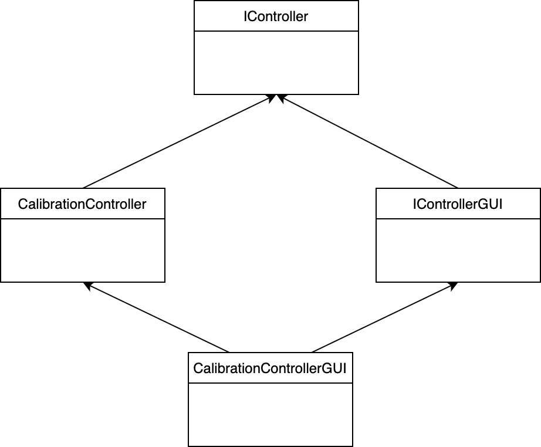

This diamond shape is common in multiple inheritance situations and can lead to errors. CalibrationGUI would have two instances of ```IController``` from ```CalibrationController``` and ```IControllerGUI```. This means that calls to methods that are defined in both ```CalibrationController``` and ```IControllerGUI``` would be ambigious because there are two methods you could call, but you don't know which one to use. This can be solved by having ```CalibrationController``` and ```IControllerGUI``` virtually inheriting ```IController```.

Multiple inheritance can be tricky, but I think it makes sense in my use case. The derived classes of ```IController``` are used by the CLI program, and ```IControllerGUI``` children code only introduce a little bit of code to interact with the GUI, so it saves a lot of code repetition by reusing code defined in ```IController```'s children.

#### **View**

Swag Scanner has a couple different views: a CLI view, GUI view, and PCL visualization view. The view is managed by the controller and the controller updates the view with data. The GUI view is a bit more complex. I built it with Qt which follows its own model-view paradigm, which merges the responsibilities of the view and the controller and stores the data in ```QModel```. Using Qt is really weird, they utilize their own Meta Object Compiler to achieve functionality such as ```signals and slots```. You are also relegated to using raw pointers when instantiation objects, but there is no need to call ```delete``` on them as they are deallocated automatically by their parent through some black magic. I decided opt out of using their model class and  instead, enforce my MVC design by treating the Qt interface strictly as a view. User actions/data is passed from the view to the controller and back through a system of signals and slots. This creates a circular dependency because the view must hold a reference to the controller, and the controller to the view. To solve this issue, I created a setter method in the view to store a reference to the controller.

I also opted to programmatically create the Qt interface instead of using its designer tool. Every repo I've seen that does this has a single file containing thousands of lines of code. In an effort to avoid creating a monolith, I separated the Qt widgets into separate files and subclassed their respective parent. This ended up adding a mammoth of complexity. When you subclass a Qt widget, its public methods are inaccessible by outsiders. This means you are forced to use its signal and slots mechanism to transfer information outside. [Others have tried to find solutions](https://forum.qt.io/topic/75892/how-to-properly-subclass-qapplication-and-access-new-methods-elsewhere/16), such as defining public static methods or static casting... but static methods won't work in instances where you need to pass Qt objects, and static casting is really ugly. So I created a really involved system of signal and slots where the child notifies the parent with data, and then parent notifies the child with a command. In the future I'm probably just going to use the designer to avoid this mess.

#### **Dynamic controller switching and caching**
Because there are several specialized controllers, the view needs access to them for performing different actions. It is very expensive to keep initializing and destroying controllers and their parameter objects, so I created a caching system to handle this. The top level contains a factory which returns a controller. If the controller does not exist in the cache, then create a new instance of it then store it. If the controller exists in the cache, then just return a reference to it. The caching system prealloctes the most often used controllers so this overhead is experienced at program launch instead of during usage.


### File handling
I wrote a custom file handling system to manage SwagScanner's settings and manage scanning data. When Swag Scanner is loaded for the first time, it will create its system folder in the user's ```/Application Support``` directory, which is where other MacOS applications data live. The picture below is structure of Swag Scanner's system folder.

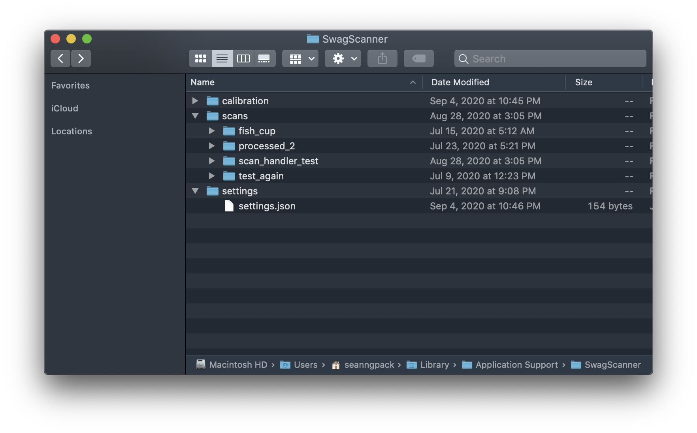

The file handler system supports many features. It can automatically create new scan folders with auto-incremented names and dynamically update settings.


### Testing
I utilized Google Tests and am in processing of increasing code coverage.


### Random CMake thoughts
At first, I hated CMake--but that's probably because I didn't really understand what was going on. Now that I understand it a bit better after sloging through its documentation, I have gained a new appreciation for it. Swag Scanner has a CMakeLists.txt file in each of its subdirectories because it allows me in the future to completely control which parts of the system I want to build. Building this project from scratch takes forever, so having the option to opt out of building certain subsystems which you won't use is nice.

Also, I haven't seen many people apply this technique--I am compiling Swag Scanner as a static library. Then I am linking it to the main run executable in addition to linking it to the main executable of my unit tests. This is a complete game changer because it means I do not have to recompile core files twice to do unit testing!

</details>
</br>

<details>
  <summary>Python Program Design (old)</summary>
</br>

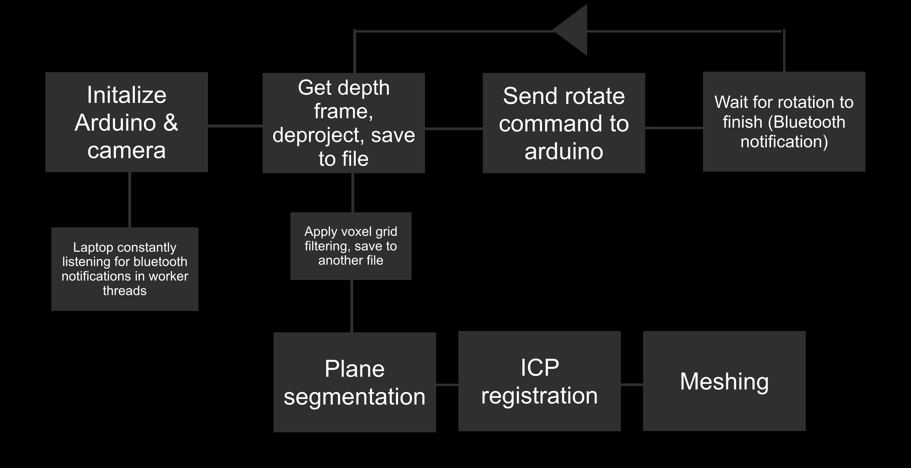

### Entry Point
First, we define the entry point of the application `scan.py` and create a `Scan()` object to handle abstracting each major steps in the scanning pipeline to be run sequentially (note: not all actions are synchronous in SwagScanner!)

### Camera()
The `Camera()` class is an interface that can be extended to provide ability to use any depth camera. Looking at the `D435` object, we override the `get_intrinsics()` method with RealSense API calls to get the intrinsics of the camera.

### Arduino()
The `Arduino()` class provides methods to initialize the Arduino and send bluetooth commands to it. We subscribe to asynchronous notifications from a custom bluetooth service which provides table state information.

### DepthProcessor()
This class is a class factory builder that takes in a `Camera()` object and a `boolean` flag and returns either a fast or slow depth processing unit. Using the fast unit, we gain the ability to use `deproject_depth_frame()` with vectorized math operations for point to pixel deprojection. The slow unit utilizes a **much (300x)** slower double for loop to perform that task. One drawback with the fast deprojection method is that it does not account for any distortion models in the frame. If you are using Intel depth cameras that is OK because the developers advised against that since distortion is so low. The same may not be true for the Kinect however. Subclass the `DepthProcessor()` object and override the `deproject_depth_frame()` method if you would like to include your own distortion model.

### Filtering()
This provides the tools to perform voxel grid filtering which downsamples our pointcloud by the `leaf_size` parameter and saves it. This step is essential for registration because performing registration on a massive pointcloud would take a very long time to converge. One more thing we have to do in filtering is segment the plane from each pointcloud. We run the RANSAC (random sample concensus) algorithm and fit a plane model (ax + by + cz + d= 0) to our cloud and detect the inliers. Using the inliers and plane model, we can reject those points and obtain a pointcloud without a the scanning bed plane. This is essential to do before registration so that we don't take a subset of the cloud belonging to the plane and encounter a false-positive icp convergence.

### Registration()
The `Registration()` class provides the tools to iteratively register pairs of clouds. Using global iterative registration, we define a `global_transform` variable as the identity matrix of size 4x4. Then we apply the iterative closest point algorithm to a a source, target cloud pair and get the source -> target cloud transformation as a 4x4 transformation matrix. Then we take the inverse of that matrix `transf_inv` to get the transformation from target->source. We multiply the target by the global transform (remember: this is the first iteration, the `global_transform` is still the identity matrix) to get the target cloud in the same reference frame as the source and save the cloud. Then we dot product `global_transform` and `transf_inv` to update the global transformation. Move on to the next pair of clouds and repeat. 

</details>
</br>


<details>
    <summary>Bluetooth & Concurrency</summary>
    </br>

I wrote a library to handle bluetooth functionality. Check it out: [github link](https://www.github.com/seanngpack/feeling-blue-cpp). The bluetooth library uses semaphores and callbacks to control the program flow. In Swag Scanner, I use a simple mutex and conditional variable in the arduino's ```rotate()``` method which blocks the calling thread until the arduino sends a notification that the table has stopped rotating.


</details>
</br>


## **Hardware Design**
This section details the design I process I went through to create the hardware. The main idea is that initially I wanted a semi-modular platform that I could tweak and change parameters as I learned more about scanning. SwagScanner is currently undergoing a complete hardware revamp.

<details>
  <summary>Hardware design</summary>
  </br>

One of the main focuses of the hardware design was the ease of assembly, repairability, and upgradeability. I went with a worm drive gearbox for the rotating bed because of its inherit ability to resist backdriving. The driven gear is connected to a stainless steel shaft. The gear and mounting hub are secured to the shaft via set screws. I hate set screws with a passion--they always come undone and end up scoring your shaft. To alleviate the woes of set screws, I reduced the vertical forces acting on them by designing the hardware stackup along the shaft so that the set screw components rest on axial thrust bearings. That way, at least the weight of the set screw components won't act on the set screws. 
Because of 3D printing tolerances, there may be shaft misalignment in addition to misalignment between the gears due to the stepper motor mount. I mitigated this issue by designing the floating brace to be slightly compliant.


Designing the turntable assembly to be assembled from the bottom-up in an intuitive way proved to be extremely challenging. I had many factors to considering including 3D printability, wall thicknesses to mask screw heads, structural integrity, and overall component-to-component interaction. I also optimized the design of each component to standardize fastener sizes. 

I envisioned the electronics housing to have removable sides for easy access to the electronics for debugging. I designed a self-aligning sliding profile to resist motion in all axii except the Z (up and down).

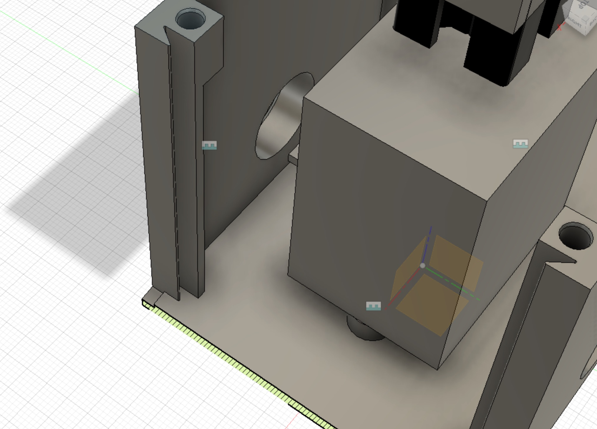

The aluminum pipe bridging the electronics housing and turntable is secured through friction on both ends.

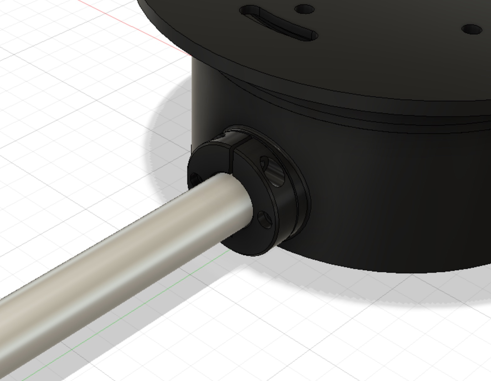

Overall, I think assembly is pretty easy--check out some photos of the build process.

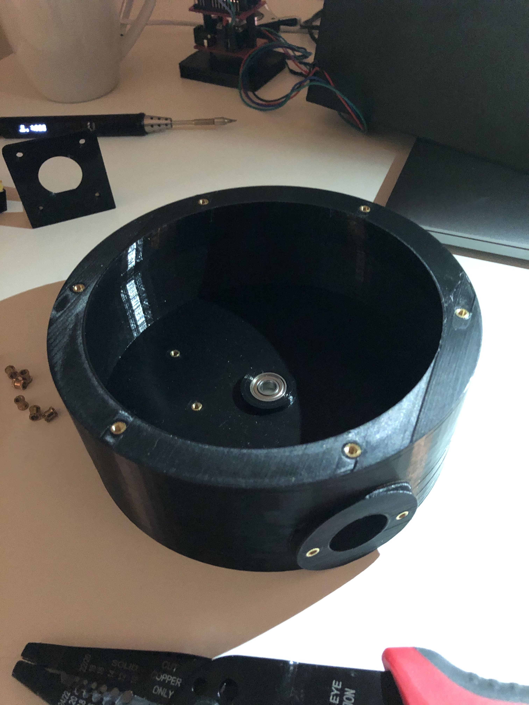
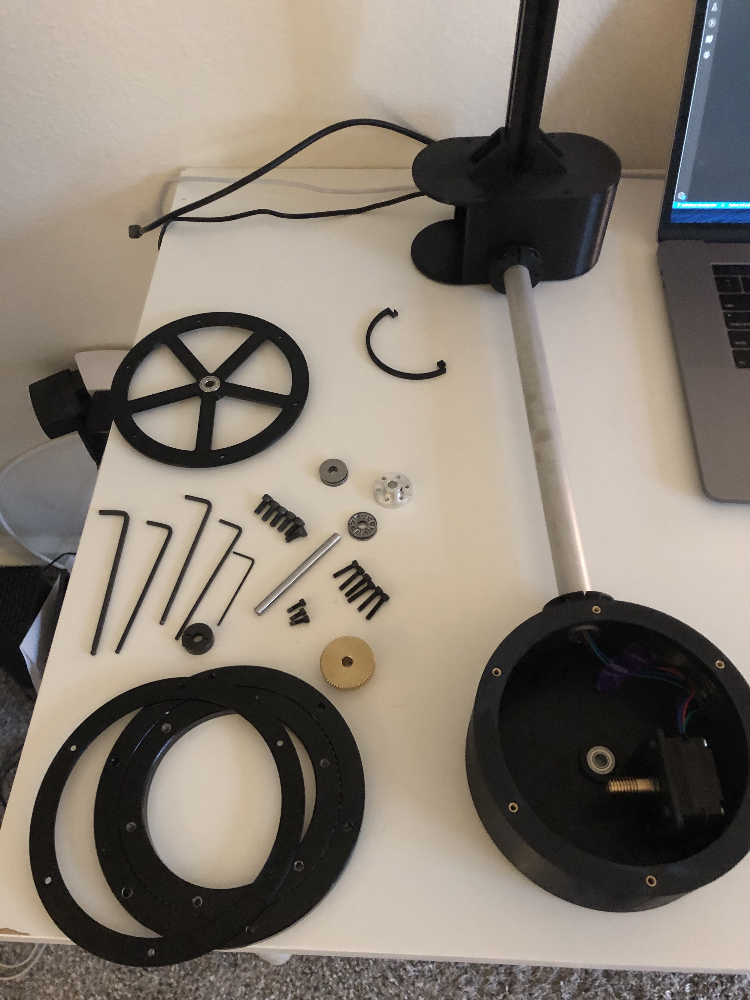
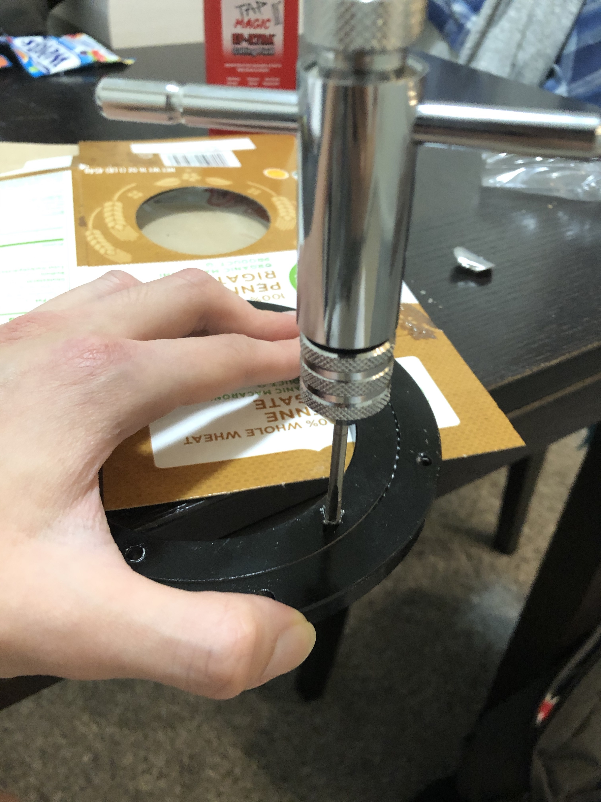
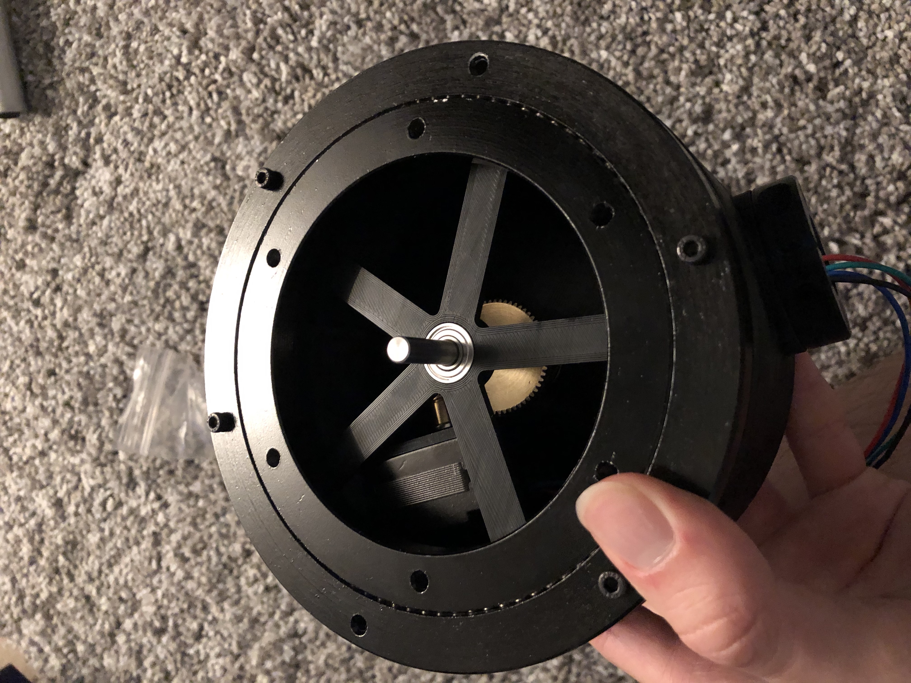

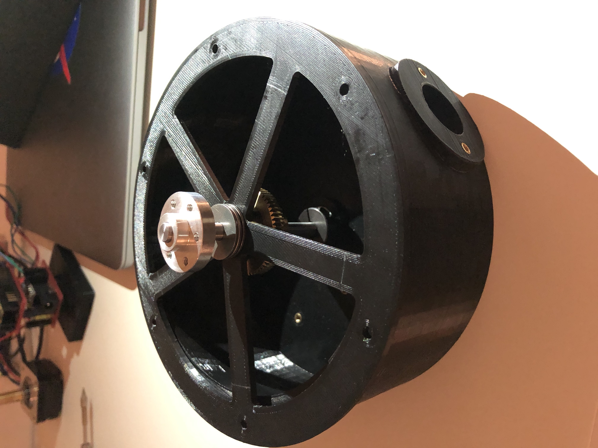
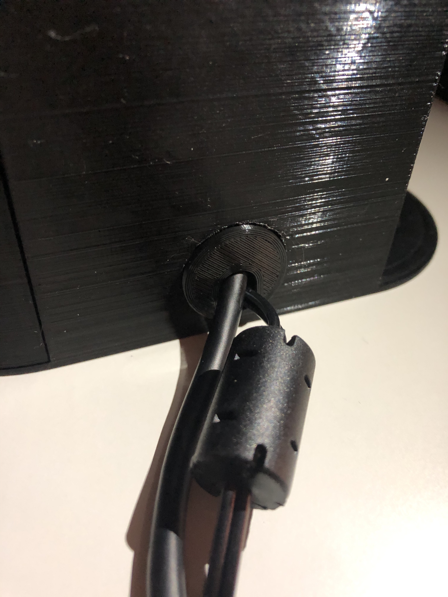

</details> 
</br>


<details>
  <summary>Electronics Design</summary>
  </br>

For the electronics, I went with a stacked board design to save horizontal space for additional components I may add in the future. Hotswaping components is also very straightforward in the case that anything blows up. I am powering the Arduino and stepper driver using a 12V 2a wall adapter. I did not add a voltage regulator such as a LM317 (cheap linear regulator) or a switching regulator to my Arduino. This is because my Arduino iot33 comes with a MPM3610 which its [spec sheets](https://www.monolithicpower.com/en/mpm3610.html) indicates to be a large upgrade compared to the voltage regulator supplied in normal Arduinos. I also opted to use Dupont connectors instead of more secure JST connectors because I like the ease of cable removal with the Dupont connectors whereas I find JST connector to get stuck often.

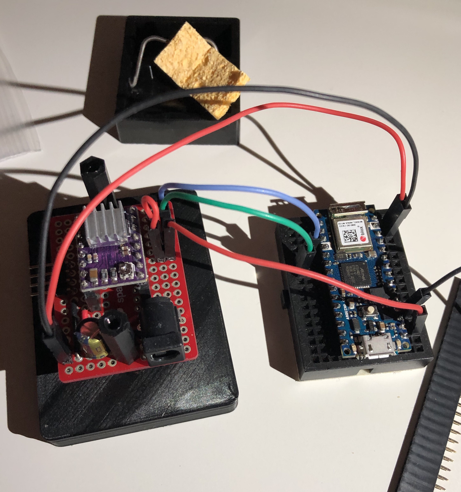
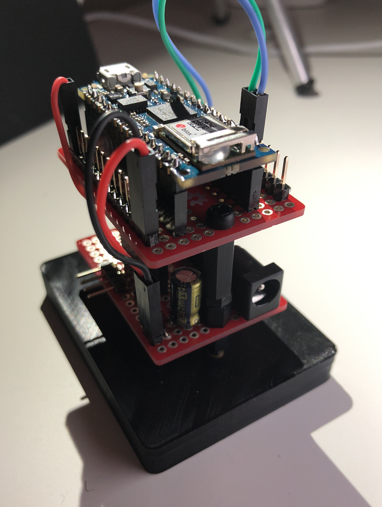
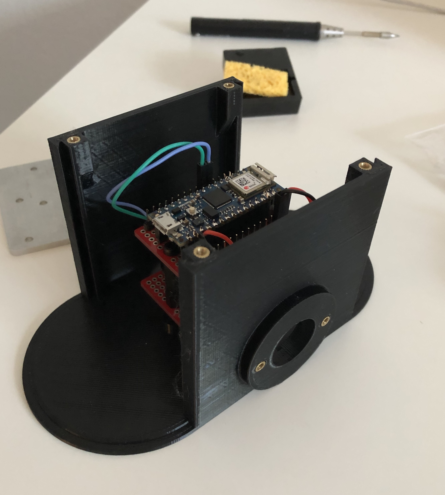

In the back you can see my TS80 soldering iron. It is worth the hype!

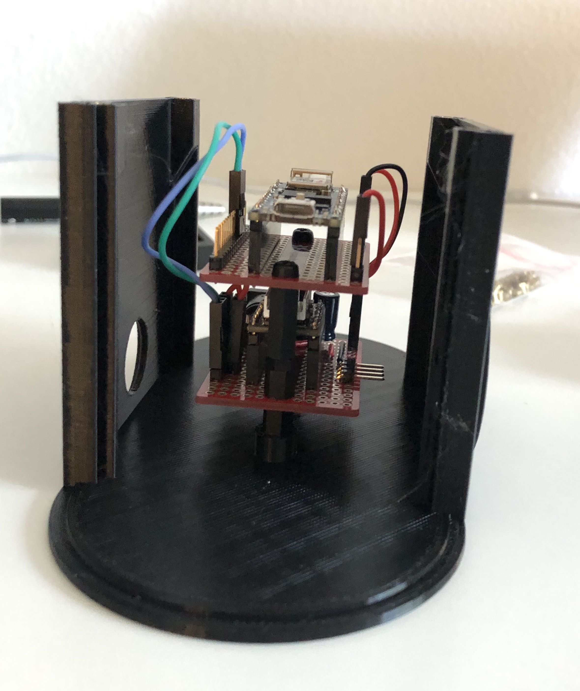

</details> 
</br>

## **Results (outdated)**

This section outlines results from the current scanning pipeline. The first subsection gives images and descriptions of what is currently achieved. The second section details methods that are used to improve the results in addition to methods I will use in the future.

<details>
  <summary>Results</summary>
</br>


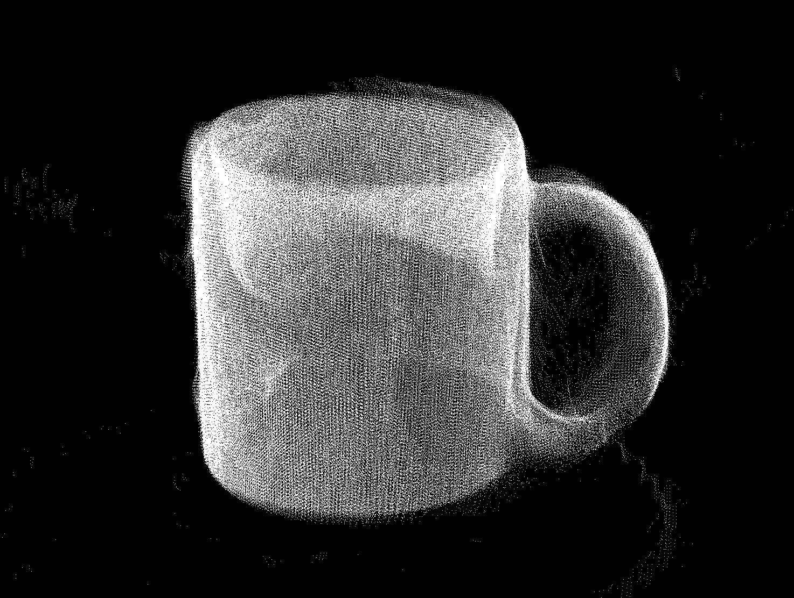

The scan was obtained using my Python codebase, these results are outdated and will be updated soon. Here is a scan of a mug using 9 degree rotation intervals. The result is a pointcloud of ~800,000 points. You can see there is a bit of scatter because I have not created a filter to remove them yet. You can also somewhat make out the edges of the bed and those are points not captured by RANSAC plane segmentation. There's still a lot of work I need to do to generate better pointclouds.

</details> 
</br>

<details>
  <summary>Improving results</summary>
</br>

**Work in progress!**

###Physical noise reduction

Depth data collected by the intel Realsense cameras are very noisy compared to data from the Kinect. In the pointcloud below taken by the SR305, you can see the noise represented by the wavy pattern. I can mitigate noise in two days, first using physical means, and second with post-processing. Because SwagScanner can support multiple cameras, it would be easier to generalize noise-reduction. All depth cameras generate more noise as the distance increases (the ratio between noise to distance varies camera to camera though), so I designed the distance between the camera and scanning object to be at the minimum scanning distance for the set of sensors. I also outline constraints for the user such as using the scanner indoors with minimal reflective surfaces in the room. 

###Post-processing noise reduction
I have found very good results applying a spatial-edge preserving filter to smooth noise from the Realsense cameras. This filter runs very fast and smoothens the data while maintaining edges. I used the filter provided by librealsense SDK. One parameter it takes is the smooth alpha which affects how aggressive the filter is. The lower the value, the more aggressive the filter and more rounded the edges become.

###Other methods of noies reduction
Other methods of noise reduction would add more complexity to the system than needed. Outlined in [intel's paper for tuning Realsense cameras](https://www.intel.com/content/dam/support/us/en/documents/emerging-technologies/intel-realsense-technology/BKMs_Tuning_RealSense_D4xx_Cam.pdf), it is possible to use an external project to increase depth quality, among several other methods.

###Noise from scanning bed

Originally I was using a white scanning surface. It was very easy to detect its plane and remove it from the cloud at the end. However, it seems like a combination of it reflectiveness and slightly glossy surface was introducing noise to the bottom of the scans. In the photo below you can see a rounded corner between the bed and the object. 


</details> 
</br>


<details>
  <summary>Lessons learned</summary>
</br>

### **Lessons Learned So Far**
On a high level, working on this project reinforced my ability to understand and bounce between high-level and low-level subsystems both on the hardware and software side. In this section, I will outline lessons learned in bullet format hoping that people can learn from my mistakes at a glance instead of reading a wall of text.


</details> 
</br>


