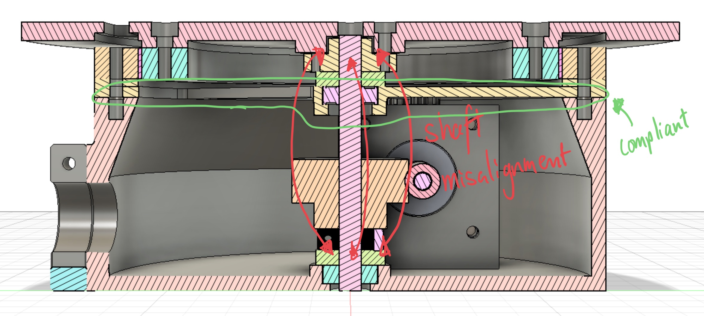
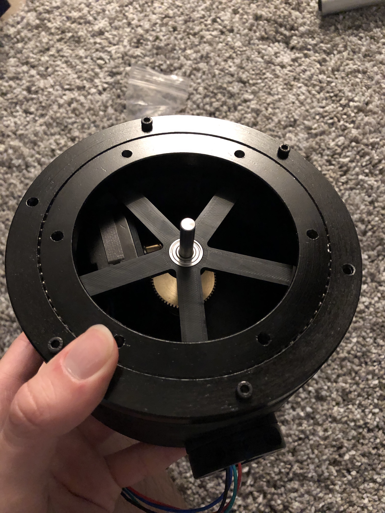

## **Github**
- Python: https://github.com/seanngpack/swag-scanner

- C++: https://github.com/seanngpack/swag-scanner-cpp

`video: https://youtu.be/pr8KoeEaKFc`


## **About**

SwagScanner is a 3D scanning system that scans an object into cyberspace. The user places an object on the rotating bed which scanned at a constant interval for a full rotation. The data goes through a processing pipeline and the output is a refined pointcloud of the scanned object. Swag Scanner has two codebases: one in Python and one in C++. I am currently dropping development of the Python codebase in favor of C++.

## **Features**

SwagScanner, although still in its early stages, contains a wide array of features.

<details>
  <summary>Click to see features</summary>
</br> 

&nbsp;&nbsp;&nbsp;&nbsp; **Software** \
&nbsp;&nbsp;&nbsp;&nbsp;&nbsp;&nbsp;&nbsp; High performance codebases in C++ and Python \
&nbsp;&nbsp;&nbsp;&nbsp;&nbsp;&nbsp;&nbsp; Extensible camera interface allows use of any depth camera \
&nbsp;&nbsp;&nbsp;&nbsp;&nbsp;&nbsp;&nbsp; Super fast depth deprojection \
&nbsp;&nbsp;&nbsp;&nbsp;&nbsp;&nbsp;&nbsp; Saves pointclouds to files \

&nbsp;&nbsp;&nbsp;&nbsp; **Hardware** \
&nbsp;&nbsp;&nbsp;&nbsp;&nbsp;&nbsp;&nbsp; Elegant, integrated design \
&nbsp;&nbsp;&nbsp;&nbsp;&nbsp;&nbsp;&nbsp; Simple bottom-up assembly \
&nbsp;&nbsp;&nbsp;&nbsp;&nbsp;&nbsp;&nbsp; Self-locking gearbox \
&nbsp;&nbsp;&nbsp;&nbsp;&nbsp;&nbsp;&nbsp; Rotating bed can withstand high axial & radial loads 

&nbsp;&nbsp;&nbsp;&nbsp; **Electronics** \
&nbsp;&nbsp;&nbsp;&nbsp;&nbsp;&nbsp;&nbsp; Custom vertical board design \
&nbsp;&nbsp;&nbsp;&nbsp;&nbsp;&nbsp;&nbsp; Easy hotswapping of motor driver and arduino boards \
&nbsp;&nbsp;&nbsp;&nbsp;&nbsp;&nbsp;&nbsp; Minimized number of cables and cable lengths

## Technical

&nbsp;&nbsp;&nbsp;&nbsp; **Software** \
&nbsp;&nbsp;&nbsp;&nbsp;&nbsp;&nbsp;&nbsp; Python, C++, PCL, NumPy  \
&nbsp;&nbsp;&nbsp;&nbsp;&nbsp;&nbsp;&nbsp; BluetoothLE 

&nbsp;&nbsp;&nbsp;&nbsp; **Hardware** \
&nbsp;&nbsp;&nbsp;&nbsp;&nbsp;&nbsp;&nbsp; 6.2 N-m torque @ 80% efficiency \
&nbsp;&nbsp;&nbsp;&nbsp;&nbsp;&nbsp;&nbsp; Slew bearing for bed rotation \
&nbsp;&nbsp;&nbsp;&nbsp;&nbsp;&nbsp;&nbsp; ~300g PLA filament \
&nbsp;&nbsp;&nbsp;&nbsp;&nbsp;&nbsp;&nbsp; Intel SR305 realsense sensor

&nbsp;&nbsp;&nbsp;&nbsp; **Electronics** \
&nbsp;&nbsp;&nbsp;&nbsp;&nbsp;&nbsp;&nbsp; DRV8825 driver \
&nbsp;&nbsp;&nbsp;&nbsp;&nbsp;&nbsp;&nbsp; Arduino 33 iot ble \
&nbsp;&nbsp;&nbsp;&nbsp;&nbsp;&nbsp;&nbsp; Dupont connectors

</br>

</details> 
</br>

## **Initial Design process**

I made a working prototype in only 1.5 months during my free time after work while I was a co-op at NASA JPL. I spent the first week of the project doing hardcore research about 3d scanners available on the market and to my surpise, there were very few commericially available options and even fewer hobby projects. Those that were for sale were priced way too high for an average consumer to to purchase so that further motivated me to pursue this project. Click below to read more about how I started this project.

<details>
  <summary>More details</summary>
</br> 

 I took inspiration from existing devices and sketched several different designs of the hardware architecture of the scanner. One of the main hardware decisions is whether I wanted the scanner have a camera revolve around an object, or have the object rotate. I chose the latter because that approach seemed to result in high accuracy scans in addition to being much more feasible to create. Then I narrowed in to more of the specifics of the scanner, I wanted it to look aesthetic, have minimal cables, and support small-medium sized objects. I achieved these design objectives by creating a modular scanner design where the distance between the scanning bed and camera can be adjusted both in height and length and the cables are hidden in this mechanism. I created some basic dimensions for my sketch and begun ordering metal hardware. Then I sketched and planned the electronics layout to fit inside my mechanical housing and ordered those parts soonafter. I wanted the electronics to be robust and repairable so I created my own stacked board design where the Arduino and motor driver can be hotswapped without soldering. As those parts were arriving, I hopped onto Fusion360 and CADed up my design to be 3D printed. As an additional challenge, I only used my trackpad to do the CAD. I took care in designing keep-out regions where the electronics were to be housed so heat buildup and other part interference would be mitigated. I also went through many iterations to make the assembly of the parts extremely easy, which was one of the hardest parts of the build because I had to work through building and designing the hardware backwards and forwards, anticipating pain points. Getting tolerances for fitting 3D printed parts was pretty easy as I have a lot of experience in 3D printed designs for my past personal projects and during my co-op at Speck. As I was wrapping up CAD design, I 3D printed the parts and started coding the brains of the project. I had to bust out my linear algrebra textbooks again to understand better how to program the scanner. I chose Python as the language because of its ease of use. I sketched up the architecture of my program and implemented it quickly before I had to leave California to go back to Boston. I managed to come up with a working prototype and even got to show it off at JPL for my final presentation!

</br>

</details> 
</br>

## **C++ Codebase Design**

I wrote SwagScanner in C++ for speed and control over every aspect of the program.

<details>
  <summary>More details</summary>
</br>

### Under construction rn.

### Program design
I utilized MVC (model-view-controller) design for this project. The models are represented by the data handling objects, views are the commandline interface and GUI interfaces, and controllers manages the scanning and processing pipelines. I focused on clean design and scalability from the get-go which quickly netted substantial benefits. Adding new features and extending existing code is pretty painless. For example, when adding a new camera system, I can just implement the ICamera interface and override the default virtual methods. Utilizing the new camera is as simple as passing it as a parameter to the ScanController object.

I separated utility functions into their own headers. These functions are dumb and do not need access to class states, similar to static methods from Java. For example, registration methods are implemented inline the Registration.h file in the registration namespace. Then they are utilized in the ProcessingModel object. 

Currently, there are a lot of raw pointers in the program. I am slowly making the transition over to smart pointers as the needs arise, however I am confident in managing ownership and memory allocation so they are fine for now. One example of where I needed a smart pointer is with my FileHandler class. I needed an instance of this class to be passed to multiple objects and that brings up the ownership problem. Which object is responsible for deleting FileHandler and when? Using a shared_ptr solved this issue with reference counting, and file_handler will be deleted when the number of references to it reaches 0.


### File handling
I wrote a custom file handling system to manage SwagScanner's settings save and load scans. When creating an instance of FileHandler, it checks to see if there is a SwagScanner folder in your ```Library/Application Support``` folder. If it doesn't exist, then create one. I chose this to be the default path because Mac applications store their data to this folder by default. Inside the SwagScanner folder you will find ```scans```, ```settings```, and ```calibration``` folders. 


#### /scans
This is where scans are located. Inside the scans folder there are ```filtered```, ```info```, ```normals```, ```raw```, and ```segmented``` folders.

The file handler is really smart. You can tell it to create a new scan folder and populate it with default information in place until a scan is run. It will also use the latest calibration stored in the /calibration folder. The new scan folder is named numerically, so if there are names "0", "1", in the /scans folder, a "2" folder will be created. If you don't want to run a new scan, then you can pass the name of the old scan and the file handler set that scan as the current scan. And if you want to use the last run scan, then don't pass anything to the file handler and it will find that information via /info folder.


### Testing
I utilized Google Tests and unit tested most methods. Soon I will add mocks to the test suite.

</details>
</br>


## **Python Codebase Design**

This was SwagScanner's original codebase. I wrote it in Python to build a working prototype fast. The Python codebase is currently not being supported.

<details>
  <summary>More details</summary>
</br>


### Entry Point
First, we define the entry point of the application `scan.py` and create a `Scan()` object to handle abstracting each major steps in the scanning pipeline to be run sequentially (note: not all actions are synchronous in SwagScanner!)

### Camera()
The `Camera()` class is an interface that can be extended to provide ability to use any depth camera. Looking at the `D435` object, we override the `get_intrinsics()` method with RealSense API calls to get the intrinsics of the camera.

### Arduino()
The `Arduino()` class provides methods to initialize the Arduino and send bluetooth commands to it. We subscribe to asynchronous notifications from a custom bluetooth service which provides table state information.

### DepthProcessor()
This class is a class factory builder that takes in a `Camera()` object and a `boolean` flag and returns either a fast or slow depth processing unit. Using the fast unit, we gain the ability to use `deproject_depth_frame()` with vectorized math operations for point to pixel deprojection. The slow unit utilizes a **much (300x)** slower double for loop to perform that task. One drawback with the fast deprojection method is that it does not account for any distortion models in the frame. If you are using Intel depth cameras that is OK because the developers advised against that since distortion is so low. The same may not be true for the Kinect however. Subclass the `DepthProcessor()` object and override the `deproject_depth_frame()` method if you would like to include your own distortion model.

### Filtering()
This provides the tools to perform voxel grid filtering which downsamples our pointcloud by the `leaf_size` parameter and saves it. This step is essential for registration because performing registration on a massive pointcloud would take a very long time to converge. One more thing we have to do in filtering is segment the plane from each pointcloud. We run the RANSAC (random sample concensus) algorithm and fit a plane model (ax + by + cz + d= 0) to our cloud and detect the inliers. Using the inliers and plane model, we can reject those points and obtain a pointcloud without a the scanning bed plane. This is essential to do before registration so that we don't take a subset of the cloud belonging to the plane and encounter a false-positive icp convergence.

### Registration()
The `Registration()` class provides the tools to iteratively register pairs of clouds. Using global iterative registration, we define a `global_transform` variable as the identity matrix of size 4x4. Then we apply the iterative closest point algorithm to a a source, target cloud pair and get the source -> target cloud transformation as a 4x4 transformation matrix. Then we take the inverse of that matrix `transf_inv` to get the transformation from target->source. We multiply the target by the global transform (remember: this is the first iteration, the `global_transform` is still the identity matrix) to get the target cloud in the same reference frame as the source and save the cloud. Then we dot product `global_transform` and `transf_inv` to update the global transformation. Move on to the next pair of clouds and repeat. 

</details>
</br>

## **Bluetooth & Concurrency**
For an extra layer of complexity I decided to add bluetoothLE capability to SwagScanner. The purpose of bluetooth in this project is to send commands to the arduino wirelessly in addition to receiving updates from the arduino to the computer such as table position. Wireless connectivity allows one less cable coming out of the scanner to the computer. In Python, I used Adafruit's BluetoothLE library to achieve connectivity. In C++ I utilized Apple's CoreBluetooth framework and wrote my own C++ wrapper for it.
<details>
    <summary>Read more about how I did bluetooth</summary>
    </br>

I used an object delegation pattern to achieve Objective-C++ compatibility. I will include a diagram soon, it is kind of complicated. I wrote the wrapper to run CoreBluetooth in a background thread so it didn't block the main thread. Getting CoreBluetooth to run on a different thread was huge challenge because there were absolutely no resources or attempts I could find about people trying to do this. After I delved deeper into Objective C [run loops](https://developer.apple.com/library/archive/documentation/Cocoa/Conceptual/Multithreading/RunLoopManagement/RunLoopManagement.html) and [dispatch queues](https://developer.apple.com/library/archive/documentation/General/Conceptual/ConcurrencyProgrammingGuide/OperationQueues/OperationQueues.html), I had a better idea to tackle the problem. I ended up executing CoreBluetooth in a separate thread, attaching a runloop to that thread, and running its callbacks on a serial dispatch queue. This worked perfectly and I was able to run Corebluetooth asynchronously to my main program. Then came the problem of race conditions. In my program, connecting to bluetooth occured after initizing my Arduino object which lead to my program exploding. Another race condition occured during the scanning process where the camera would take an image because the table stopped rotating.

 My first solution was in the Arduino object, to create a ```is_rotating``` variable and setter method allowing outside customers to modify it. When the rotate() command was called, I did a while loop to block the thread and poll every 10ms to see if the variable changed and continue if it was false. This came with a couple drawbacks. First, I had to pass a void * pointer to the Arduino to the Objective-C code as a callback object. I did not like this idea of passing the Arduino object because it mangles ownership of my Arduino object which previously only belonged to my controller. Plus it was a little dirty having to write public methods that would only be executed by Objective-C and nobody else. In addition, polling every **X** seconds was a performance hog and waste of resources. Increasing the time interval was not great either because sometimes it would execute quickly towards the lower bound of the interval, and sometimes it would execute towards the upper bound. 
 
 There was a much better solution with mutexes. I created an ArduinoEventHandler object that held references to conditional & control variables and mutexes. The event handler is responsible for executing arduino commands to the CoreBluetooth object and managing concurrency. The CoreBluetooth Object holds a void * pointer reference the the event handler to access its fields. Below is an example of the control flow of rotating the table. In the near future I will release my C++ wrapper as its own standalone library because I think people could benefit from my struggles.


</details>
</br>

## **Calibration**

I developed a calibration fixture and method to find the axis of rotation of the scanning table. This allows me to align each scanned pointcloud to the first scan and construct a full image.

<details>
    <summary>warning: lots of math</summary>
</br>

### Under construction rn.

</details>
</br>

## **Hardware Design**
Leveraging my experience in product design and functional prototyping, I created SwagScanner to be a manifestation of my knowledge and experiences.

<details>
  <summary>More details</summary>
  </br>

One of the main focuses of the hardware design was the ease of assembly, repairability, and upgradeability. I went with a worm drive gearbox for the rotating bed because of its inherit ability to resist backdriving. The driven gear is connected to a stainless steel shaft. The gear and mounting hub are secured to the shaft via set screws. I hate set screws with a passion--they always come undone and end up scoring your shaft. To alleviate the woes of set screws, I reduced the vertical forces acting on them by designing the hardware stackup along the shaft so that the set screw components rest on axial thrust bearings. That way, at least the weight of the set screw components won't act on the set screws. 
Because of 3D printing tolerances, there may be shaft misalignment in addition to misalignment between the gears due to the stepper motor mount. I mitigated this issue by designing the floating brace to be slightly compliant.



Designing the turntable assembly to be assembled from the bottom-up in an intuitive way proved to be extremely challenging. I had many factors to considering including 3D printability, wall thicknesses to mask screw heads, structural integrity, and overall component-to-component interaction. I also optimized the design of each component to standardize fastener sizes. 

I envisioned the electronics housing to have removable sides for easy access to the electronics for debugging. I designed a self-aligning sliding profile to resist motion in all axii except the Z (up and down).


The aluminum pipe bridging the electronics housing and turntable is secured through friction on both ends.


Overall, I think assembly is pretty easy--check out some photos of the build process.





</details> 
</br>

## **Electronics Design**
I selected the electronics to integrate seamlessly into the hardware. I did a lot of part picking research, soldering, and crimping to get the electronics neatly assembled.

<details>
  <summary>More details</summary>
  </br>

For the electronics, I went with a stacked board design to save horizontal space for additional components I may add in the future. Hotswaping components is also very straightforward in the case that anything blows up. I am powering the Arduino and stepper driver using a 12V 2a wall adapter. I did not add a voltage regulator such as a LM317 (cheap linear regulator) or a switching regulator to my Arduino. This is because my Arduino iot33 comes with a MPM3610 which its [spec sheets](https://www.monolithicpower.com/en/mpm3610.html) indicates to be a large upgrade compared to the voltage regulator supplied in normal Arduinos. I also opted to use Dupont connectors instead of more secure JST connectors because I like the ease of cable removal with the Dupont connectors whereas I find JST connector to get stuck often.


In the back you can see my TS80 soldering iron. It is worth the hype!


</details> 
</br>

## **Results (outdated)**
<details>
  <summary>More details</summary>
</br>


The scan was obtained using my Python codebase, these results are outdated and will be updated soon. Here is a scan of a mug using 9 degree rotation intervals. The result is a pointcloud of ~800,000 points. You can see there is a bit of scatter because I have not created a filter to remove them yet. You can also somewhat make out the edges of the bed and those are points not captured by RANSAC plane segmentation. There's still a lot of work I need to do to generate better pointclouds.

</details> 
</br>


## **What I've learned so far**
Working on this project really reinforced my ability to understand and bounce between levels of interaction and scope both on the hardware and software side. At the highest level, I had to define system characteristics that I then implemented. Working out how the hardware and software systems interacted with each other was kind of a mind-bend at first, but it quickly became more natural for me to grasp.

I feel like I gained a great understanding of interaction between components at every level. In each subsystem there's a tricky balance of performance, aesthetics, size, and a multitude of other characteristics that are intertwined with each other. For example, when designing the circuit board, I initially wanted the absolute smallest form factor possible. The benefit of a super small form factor would save space in the housing for other components at the cost of hotter components on the board, less modularity, and more difficulty in repairs. I converged to a circuit board design that balanced the tradeoffs while maintaining a small profile. Another instance of component-to-component interaction that was crucial was in material selection. I used a variety of materials in the system (PLA, aluminum, steel, brass) so I had to understand how these materials affect each other, whether one corrodes, scratches, or wears another downn. Understanding how to design for each component to interact with each other was crucial in bringing together this project.

