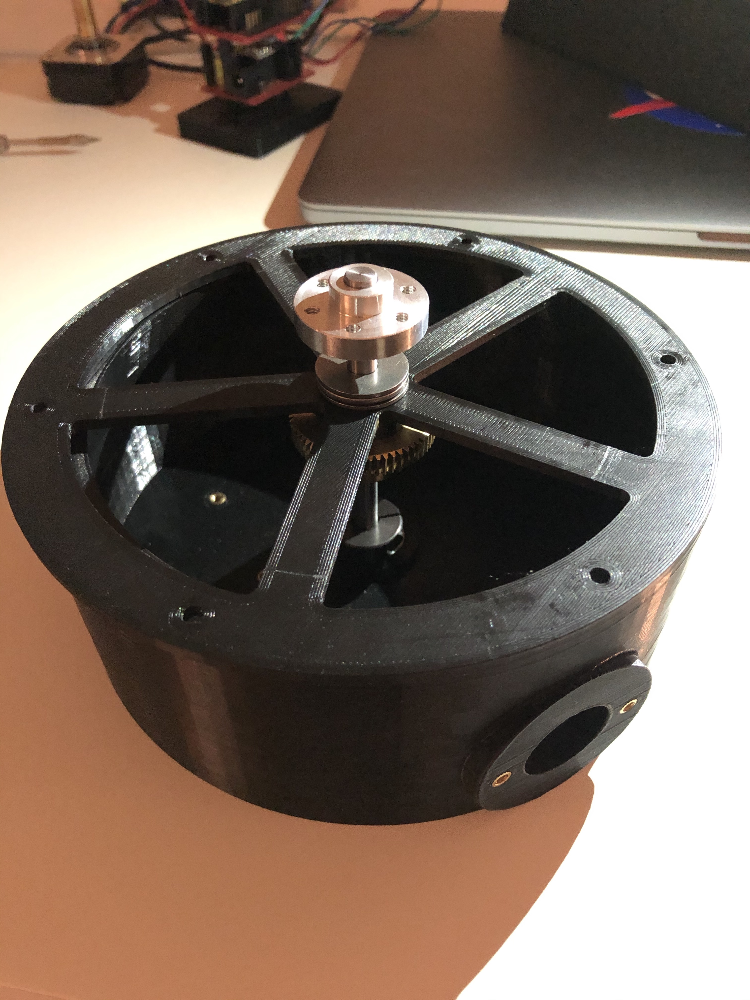

## Find out more here: 
https://github.com/seanngpack/swag-scanner

`video: https://youtu.be/pr8KoeEaKFc`

## About

SwagScanner is a 3D scanning system that scans an object into cyberspace. The user places an object on the rotating bed which scanned at a constant interval for a full rotation. The data goes through a processing pipeline and the output is a refined pointcloud of the scanned object. I ran my own design sprint to build a robust system in only 1.5 months with my free time. Why did I tackle a project like this? I thought it would be fun to challenge myself with a project that has not been done (or atleast documented) before.

## Features

&nbsp;&nbsp;&nbsp;&nbsp; **Software** \
&nbsp;&nbsp;&nbsp;&nbsp;&nbsp;&nbsp;&nbsp; Highly modular system design \
&nbsp;&nbsp;&nbsp;&nbsp;&nbsp;&nbsp;&nbsp; Extensible camera interface allows use of any depth camera \
&nbsp;&nbsp;&nbsp;&nbsp;&nbsp;&nbsp;&nbsp; Super fast depth deprojection \
&nbsp;&nbsp;&nbsp;&nbsp;&nbsp;&nbsp;&nbsp; Saves pointclouds to files \
&nbsp;&nbsp;&nbsp;&nbsp;&nbsp;&nbsp;&nbsp; Iterative closest point algorithm for registration \
&nbsp;&nbsp;&nbsp;&nbsp;&nbsp;&nbsp;&nbsp; RANSAC plane segmentation

&nbsp;&nbsp;&nbsp;&nbsp; **Hardware** \
&nbsp;&nbsp;&nbsp;&nbsp;&nbsp;&nbsp;&nbsp; Elegant, integrated design \
&nbsp;&nbsp;&nbsp;&nbsp;&nbsp;&nbsp;&nbsp; Simple bottom-up assembly \
&nbsp;&nbsp;&nbsp;&nbsp;&nbsp;&nbsp;&nbsp; Self-locking gearbox \
&nbsp;&nbsp;&nbsp;&nbsp;&nbsp;&nbsp;&nbsp; Rotating bed can withstand high axial & radial loads 

&nbsp;&nbsp;&nbsp;&nbsp; **Electronics** \
&nbsp;&nbsp;&nbsp;&nbsp;&nbsp;&nbsp;&nbsp; Custom vertical board design \
&nbsp;&nbsp;&nbsp;&nbsp;&nbsp;&nbsp;&nbsp; Easy hotswapping of motor driver and arduino boards \
&nbsp;&nbsp;&nbsp;&nbsp;&nbsp;&nbsp;&nbsp; Minimized number of cables and cable lengths

## Technical

&nbsp;&nbsp;&nbsp;&nbsp; **Software** \
&nbsp;&nbsp;&nbsp;&nbsp;&nbsp;&nbsp;&nbsp; Python, C++, PCL  \
&nbsp;&nbsp;&nbsp;&nbsp;&nbsp;&nbsp;&nbsp; ICP registration \
&nbsp;&nbsp;&nbsp;&nbsp;&nbsp;&nbsp;&nbsp; Voxel grid filtering \
&nbsp;&nbsp;&nbsp;&nbsp;&nbsp;&nbsp;&nbsp; Vectorized deprojection using intrinsics \
&nbsp;&nbsp;&nbsp;&nbsp;&nbsp;&nbsp;&nbsp; BluetoothLE Services \
&nbsp;&nbsp;&nbsp;&nbsp;&nbsp;&nbsp;&nbsp; C++ Arduino implementation 

&nbsp;&nbsp;&nbsp;&nbsp; **Hardware** \
&nbsp;&nbsp;&nbsp;&nbsp;&nbsp;&nbsp;&nbsp; 6.2 N-m torque @ 80% efficiency \
&nbsp;&nbsp;&nbsp;&nbsp;&nbsp;&nbsp;&nbsp; Slew bearing for bed rotation \
&nbsp;&nbsp;&nbsp;&nbsp;&nbsp;&nbsp;&nbsp; ~300g PLA filament \
&nbsp;&nbsp;&nbsp;&nbsp;&nbsp;&nbsp;&nbsp; Intel SR305 realsense sensor

&nbsp;&nbsp;&nbsp;&nbsp; **Electronics** \
&nbsp;&nbsp;&nbsp;&nbsp;&nbsp;&nbsp;&nbsp; DRV8825 driver \
&nbsp;&nbsp;&nbsp;&nbsp;&nbsp;&nbsp;&nbsp; Arduino 33 iot ble \
&nbsp;&nbsp;&nbsp;&nbsp;&nbsp;&nbsp;&nbsp; Dupont connectors

## Design process

  
Click to expand

  

Here is a breakdown of the design sprint I ran and some design decisions that I made during the process.

 

* weeks 1-2 

  I spent the first couple weeks researching what I was getting myself into. I took a deep dive into how 3D imaging systems worked and the different paths I could take. Having a background in mechanical engineering was really helpful in reading research papers and understanding the mathematics (linear algebra, calculus, differential equations) behind theories. Dissecting proofs is one of my weaknesses I need to get better doing. I also looked into a multitude of mechanical designs I could utilize. I had to narrow down software & hardware choices based on some criteria: robustness, quality, implementation feasibility, and size. I outlined some high-level objectives of my project and sketched some preliminary designs.

* weeks 2-3

  I created a stacked board design during this timeframe. I sketched an initial design and ordered the parts as soon as possible. I made the design very compact and modular with the ability to hotswap components solder-free. I chose the DRV8825 to drive my stepper, a small 24 oz-in NEMA 17 motor. I also wanted as few cables coming out the system as possible so I wired the stepper and arduino on the same powerline. Once the electronics were constructed, I tested them on stepper motors to verify everything worked according to my schematics. I had enough time to iterate on my board design once and further simplified the wiring.

* weeks 3-5

  I designed & assembled SwagScanner's physical hardware during these few weeks. I had many different designs I brainstormed so to narrow them down, I decided to develop my top 3 choices in parallel. I ran a Darwinian design sprint where I pursued viable ideas, developed them, and as they became more grown I weeded out the weaker ones. This design sprint worked well for me because all my initial designs seemed to accomplish my hardware criteria, but my unknown variable was how well I could implement each design so this sprint allowed me to to solve for that unknown. I spent my time designing on Fusion 360, ordering parts, writing statics equations, and assembling everything. My 3D printer basically ran 24/7 during this timeframe.

* weeks 4-6

  As I was wrapping up hardware design I started learning pointcloud theory and began working on software design.  In this time I learned BluetoothLE and created my own services and characteristics for bluetooth functionality. I also learned asynchronous actions so my system could create threaded workers to listen for notifications from the Arduino. I also learned more about depth imaging, pointclouds, and processing algorithms. 

  I sketched a system architecture for my project which outlined the interaction between my interfaces and classes. I began writing out various of the software and did math to verify & implement different algorithms.

  * weeks 7-8

  During this time I went ham and built enough of the scanner software for it to actually funcion. After I got preliminary results from the system, I did lot of testing, debugging, and also iterative hardware improvements to refine the system. I got a basic demo working and presented SwagScanner at JPL for my final internship presentation. People really liked the scanner and I felt super happy to share my work.

* weeks 8-

   Well, I'm in school now so I don't have much time to work on SwagScanner. I plan on furthering development after I graduate and find a job.

 
 

## Software design

  
Click to expand

 

### Entry Point
First, we define the entry point of the application `scan.py` and create a `Scan()` object to handle abstracting each major steps in the scanning pipeline to be run sequentially (note: not all actions are synchronous in SwagScanner!)

### Camera()
The `Camera()` class is an interface that can be extended to provide ability to use any depth camera. Looking at the `D435` object, we override the `get_intrinsics()` method with RealSense API calls to get the intrinsics of the camera.

### Arduino()
The `Arduino()` class provides methods to initialize the Arduino and send bluetooth commands to it. We subscribe to asynchronous notifications from a custom bluetooth service which provides table state information.

### DepthProcessor()
This class is a class factory builder that takes in a `Camera()` object and a `boolean` flag and returns either a fast or slow depth processing unit. Using the fast unit, we gain the ability to use `deproject_depth_frame()` with vectorized math operations for point to pixel deprojection. The slow unit utilizes a **much (300x)** slower double for loop to perform that task. One drawback with the fast deprojection method is that it does not account for any distortion models in the frame. If you are using Intel depth cameras that is OK because the developers advised against that since distortion is so low. The same may not be true for the Kinect however. Subclass the `DepthProcessor()` object and override the `deproject_depth_frame()` method if you would like to include your own distortion model.

### Filtering()
This provides the tools to perform voxel grid filtering which downsamples our pointcloud by the `leaf_size` parameter and saves it. This step is essential for registration because performing registration on a massive pointcloud would take a very long time to converge. One more thing we have to do in filtering is segment the plane from each pointcloud. We run the RANSAC (random sample concensus) algorithm and fit a plane model (ax + by + cz + d= 0) to our cloud and detect the inliers. Using the inliers and plane model, we can reject those points and obtain a pointcloud without a the scanning bed plane. This is essential to do before registration so that we don't take a subset of the cloud belonging to the plane and encounter a false-positive icp convergence.

### Registration()
The `Registration()` class provides the tools to iteratively register pairs of clouds. Using global iterative registration, we define a `global_transform` variable as the identity matrix of size 4x4. Then we apply the iterative closest point algorithm to a a source, target cloud pair and get the source -> target cloud transformation as a 4x4 transformation matrix. Then we take the inverse of that matrix `transf_inv` to get the transformation from target->source. We multiply the target by the global transform (remember: this is the first iteration, the `global_transform` is still the identity matrix) to get the target cloud in the same reference frame as the source and save the cloud. Then we dot product `global_transform` and `transf_inv` to update the global transformation. Move on to the next pair of clouds and repeat. 

 

## Hardware Design

  
Click to expand

   

Again with the theme of modularity, I focused the hardware design on easy disassembly, reassembly, and upgradeability. I went with a worm drive gearbox for the rotating bed because of its inherit ability to resist backdriving. The driven gear is connected to a stainless steel shaft. The gear and mounting hub are secured to the shaft via set screws. I hate set screws with a passion--they always come undone and end up scoring your shaft. To alleviate the woes of set screws, I reduced the vertical forces acting on them by designing the hardware stackup along the shaft so that the set screw components rest on axial thrust bearings. That way, atleast the weight of the set screw components won't act on the set screws. 
Because of 3D printing tolerances, there may be shaft misalignment in addition to misalignment between the gears due to the stepper motor mount. I mitigated this issue by designing the floating brace to be slightly compliant.

Designing the turntable assembly to be assembled from the bottom-up in an intuitive way proved to be extremely challenging. I had many factors to considering including 3D printability, wall thicknesses to mask screw heads, structural integrity, and overall component-to-component interaction. I also optimized the design of each component to standardize fastener sizes. 

I envisioned the electronics housing to have removable sides for easy access to the electronics for debugging. I designed a self-aligning sliding profile to resist motion in all axii except the Z (up and down).

The aluminum pipe bridging the electronics housing and turntable is secured through friction on both ends.

Overall, I think assembly is pretty easy--check out some photos of the build process.

 
 

## Electronics Design

  
Click to expand

   

For the electronics, I went with a stacked board design to save horizontal space for additional components I may add in the future. Hotswaping components is also very straightforward in the case that anything blows up. I am powering the Arduino and stepper driver using a 12V 2a wall adapter. I did not add a voltage regulator such as a LM317 (cheap linear regulator) or a switching regulator to my Arduino. This is because my Arduino iot33 comes with a MPM3610 which its [spec sheets](https://www.monolithicpower.com/en/mpm3610.html) indicates to be a large upgrade compared to the voltage regulator supplied in normal Arduinos. I also opted to use Dupont connectors instead of more secure JST connectors because I like the ease of cable removal with the Dupont connectors whereas I find JST connector to get stuck often.

In the back you can see my TS80 soldering iron. It is worth the hype!

 
 

## Results

Here is a scan of a mug using 9 degree rotation intervals. The result is a pointcloud of ~800,000 points. You can see there is a bit of scatter because I have not created a filter to remove them yet. You can also somewhat make out the edges of the bed and those are points not captured by RANSAC plane segmentation. There's still a lot of work I need to do to generate better pointclouds.

## What I've learned so far
Working on this project really reinforced my ability to understand and bounce between levels of interaction and scope both on the hardware and software side. At the highest level, I had to define system characteristics that I then implemented. Working out how the hardware and software systems interacted with each other was kind of a mind-bend at first, but it quickly became more natural for me to grasp.

I feel like I gained a great understanding of interaction between components at every level. In each subsystem there's a tricky balance of performance, aesthetics, size, and a multitude of other characteristics that are intertwined with each other. For example, when designing the circuit board, I initially wanted the absolute smallest form factor possible. The benefit of a super small form factor would save space in the housing for other components at the cost of hotter components on the board, less modularity, and more difficulty in repairs. I converged to a circuit board design that balanced the tradeoffs while maintaining a small profile. Another instance of component-to-component interaction that was crucial was in material selection. I used a variety of materials in the system (PLA, aluminum, steel, brass) so I had to understand how these materials affect each other, whether one corrodes, scratches, or wears another downn. Understanding how to design for each component to interact with each other was crucial in bringing together this project.

